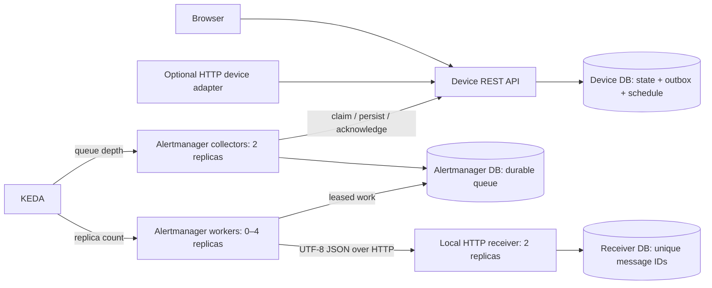

# Device signals and demand-based delivery

HomeHub's Alertmanager is an application-specific JSON delivery service, not Prometheus Alertmanager. The first adapter is simulated device state stored in PostgreSQL; external hardware can push readings through REST. The browser adds devices and displays pending/delivered signals, including the actual JSON envelope.



## Sampling and delivery

- `POST /api/devices` takes `name`, `room`, `value`, and `poll_interval_seconds` (5–3600). Device creation and its initial signal commit together.
- Polling schedules are persisted per device, with initial offsets distributed by device ID. Collectors claim up to ten due devices per iteration; multiple replicas share database locks, so replicas do not independently sample every device. A short transaction advisory lock serializes source claims and capacity checks.
- Unchanged state is suppressed. A heartbeat becomes eligible after 300 seconds and is emitted on the next due sampling turn. Late schedules resume from the current time rather than generating fictitious historical samples. With a 3600-second interval, a heartbeat can therefore take an hour.
- `PATCH /api/devices/{id}` emits a signal for a changed state in the same transaction. `POST /api/devices/{id}/signals` accepts `{message_id: UUID, online: boolean, value: string}`. A physical adapter must buffer its reading and reuse that ID until it receives a successful response. Identical retries are accepted; conflicting content under the same ID receives 409.
- Alertmanager persists source messages before acknowledging their source lease. Outbox leases expire after 30 seconds so another collector can reclaim interrupted work. Unique IDs make replay safe.
- Workers claim one message using `FOR UPDATE SKIP LOCKED`, commit a 30-second lease, and send outside the transaction. Network calls have a five-second timeout. Failure retains the message and retries with exponential delay capped at 60 seconds; there is no retry limit or silent discard.
- The receiver commits before acknowledging `{id, stored: true}`. Its unique primary key and canonical JSON SHA-256 digest accept identical duplicates but reject ID/content conflicts. A lost acknowledgement can cause another HTTP transmission, not another stored message.
- Transport is **at least once** with deduplicated storage, not exactly-once networking. Delivery ordering between devices or messages is not guaranteed. Consumers requiring per-device ordering should add producer sequence numbers and ordering rules.

The envelope contains `specversion`, `id`, `source`, `type`, `time`, `datacontenttype`, and `data`. JSON encoding is not encryption. The sender uses the persisted original timestamp and data on retries.

## Scaling and load

The always-running collector API exposes `/internal/queue-depth`, which includes every undelivered message, including leased and delayed retries. KEDA's metrics API scaler polls it every five seconds, targets ten messages per worker, and runs zero to four workers. Cooldown is 30 seconds; HPA reconciliation and Pod startup add latency. Scaler configuration follows the [official metrics API specification](https://keda.sh/docs/2.20/scalers/metrics-api/). CPU HPA remains independent for the original three APIs.

Collectors remain available when workers are at zero. More workers cannot fix an unavailable receiver; the cap limits resource waste during outages. Source pending messages are capped at 10,000 and return 503 under backpressure. Collectors pause intake at approximately 10,000 queued messages (concurrent collectors may overshoot by a batch), leaving further records at the source. No acknowledged data is dropped to enforce capacity.

Each process uses at most two database connections. Collector and worker roles share the alertmanager database because they are two execution roles of the same service; the receiver and device APIs have distinct database credentials. Existing API maximums plus two collectors, four workers, two receivers use up to 64 application connections before rollout surge, below the cluster's 100-connection limit.

## Failure boundaries and security

Kubernetes uses the existing three-instance synchronous CloudNativePG cluster, each with a PVC. Compose uses a single persistent development database. Neither replicas nor PVCs replace off-cluster backups; a one-node cluster cannot survive loss of the whole host. Pending data survives process replacement as long as the database storage survives.

Pipeline endpoints require a generated bearer token stored in an ignored local secret or Kubernetes Secret. They are not exposed by the browser proxy. KEDA receives only an internal count, not signal contents or credentials. The current internal HTTP transport and shared pipeline token are demonstration choices: production should use service-specific identities with mTLS, restricted network policies, token rotation, and authorization per producer. Public device/task APIs still need end-user authentication and HTTPS before public exposure.

The system cannot recover physical readings that were never buffered or accepted. Disk exhaustion, prolonged database unavailability, corrupt storage, and loss of the host remain risks. Delivered/outbox records are currently retained for audit and deduplication; introduce monitored retention/archival with a defined replay window before long-running use. There is no deletion API that accidentally removes queued device data. A permanently invalid message remains visible with an error and requires operator intervention.

## Run and inspect

For an existing Compose data volume, provision new databases without deleting data:

```sh
python3 scripts/create-db-secrets.py compose
docker compose up -d postgres
docker compose exec -T postgres sh /docker-entrypoint-initdb.d/10-services.sh
docker compose up -d --build
```

The initialization script creates only missing roles/databases and preserves existing passwords and records. Open `http://localhost:8080`, choose **Add device**, enter the device details, and choose **Save device**. Expand a delivery item to inspect the JSON. Refresh to verify persistence.

For Kubernetes, install `scripts/install-signal-scaler.sh` before applying the manifests. The scaler metric URL uses the `homehub` namespace; change that URL when moving the deployment to another namespace. Local access is `http://localhost:30080` on OrbStack. These Kubernetes and Compose instances have separate datasets.

```sh
kubectl get deployments,scaledobjects,hpa -n homehub
kubectl logs -n homehub deployment/alertmanager
# Worker Pods exist only while work is available.
kubectl logs -n homehub deployment/signal-worker
```

`python3 tests/verify_signal_delivery.py` temporarily stops the Compose receiver, restarts pipeline services, tests duplicate delivery, and restores the receiver. `python3 scripts/verify-signal-scaling.py` temporarily stops the Kubernetes receiver, submits 45 readings, verifies activation and multiple worker replicas, replaces worker Pods, restores the receiver, verifies every submitted ID in receiver storage, and waits for zero workers. Both leave their named verification devices/readings as evidence and must run against the local demo, not a production system.

KEDA's pinned installation has one operator instance by default. If it is unavailable while workers are at zero, messages remain stored but activation waits for its recovery. Production can run KEDA in its documented HA configuration or keep one minimum worker when lower delivery latency matters more than idle resource savings.
