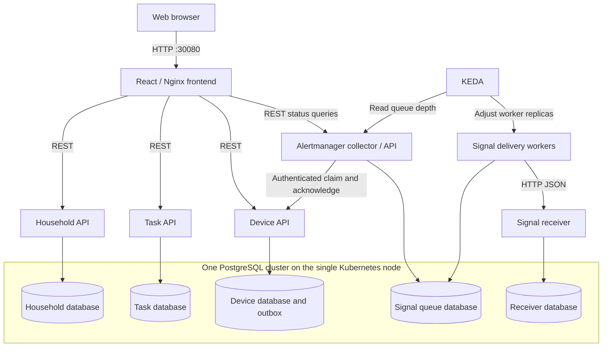
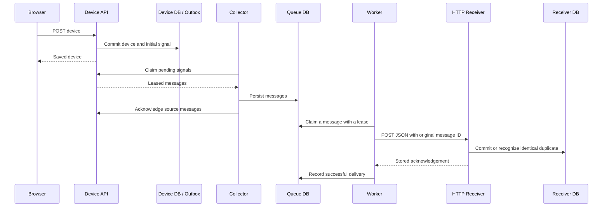

# HomeHub: A Single-Node Kubernetes Microservice Application

**Software description, architecture design, and evaluation**  
**Project version:** Frontend 0.2.2; application APIs and signal services 0.2.0  
**Deployment scope:** One OrbStack Kubernetes node  
**Report date:** 24 September 2026

## Abstract

HomeHub is a browser-based application for household coordination and simulated device monitoring. Users can view household information, create and complete shared tasks, register devices, and inspect the delivery of device signals. The implementation combines a React interface, independently deployed REST services, PostgreSQL persistence, and an asynchronous signal-delivery pipeline. Kubernetes manages the application workloads, CloudNativePG manages three PostgreSQL instances, and KEDA adjusts the number of delivery workers according to pending work.

The supported deployment uses one OrbStack node. Multiple application and database instances therefore demonstrate independent replica management and recovery from selected process failures, while sharing the same physical host and storage infrastructure. This report describes the implemented software, maps its components to microservices, and evaluates the benefits, operational challenges, security controls, and limitations of the design. It distinguishes verified behaviour from proposed improvements and does not claim host-level high availability or production readiness.

## 1. Software Description

### 1.1 Purpose and intended users

HomeHub provides a common interface for household tasks and device information. Its primary user is a household member who wants to record shared work, identify unfinished tasks, and check the state of connected devices without operating several separate tools. For example, a user can create a shopping task, mark it complete, and later confirm the saved result after refreshing the browser. The same user can register a kitchen sensor and inspect the JSON message generated from its initial reading.

The application is also a coursework demonstration of REST communication, containerization, independent service deployment, persistent storage, and Kubernetes-based scaling. Its household workload is intentionally small. A single household would not normally require this number of services and replicas. To understand the scaling decisions, the demonstration assumes that task traffic and device-message traffic can grow independently, for example during a burst of simulated sensor updates. This is a workload assumption, not a claim that the implementation already supports multiple isolated customer households.

### 1.2 User interface and implemented functionality

The interface contains three separately navigable views. Their addresses use hash-based routing, so each view can be bookmarked and revisited through browser history.

| Page | Purpose | Implemented interactions |
|---|---|---|
| Overview | Present the current household summary | View people-at-home, completed-task and online-device counts; inspect short task and device previews; navigate to the detailed pages |
| Tasks | Manage shared household work | Create a task with a title, optional due date and priority; mark it complete or incomplete; filter all, pending or completed tasks |
| Devices | Register and inspect simulated devices | Add a device with a name, room, initial reading and sampling interval; inspect readings and signal-delivery status; expand JSON messages |

Navigation changes the displayed content, active navigation state and page title. Refreshing preserves the selected page through its URL. Task and device records are read from backend services; they are not stored only in browser memory. Appearance preferences are stored locally, while business data is stored in PostgreSQL.

The frontend supports light, dark and system appearance settings, responsive layouts, labelled forms, keyboard navigation, and explicit loading, empty and error states. A failed task submission preserves the entered draft. These features improve usability, but do not replace backend validation or access control.

### 1.3 Representative user workflows

**Task workflow.** A user opens Tasks, enters a task, and submits the form. The frontend sends a JSON POST request to the Task API. After successful persistence, the new task appears in the list. Selecting its checkbox sends a PATCH request. The interface displays the state returned by the API, and a later page reload retrieves the saved record again. Filtering affects the displayed list; unlike the task's completion state, the selected filter is not persisted across a full reload.

**Device workflow.** A user opens Devices and registers a simulated sensor. The Device API stores its state and an initial outgoing signal in one database transaction. Background processing transfers that signal to a durable queue and then to a local HTTP receiver. The user can inspect pending and delivered counts and expand recent messages to see their identifiers and payloads. A Pending state means processing is not yet confirmed; Delivered reflects an acknowledgement from the receiver after storage.

### 1.4 Scope and exclusions

The current device adapter simulates devices using state stored in PostgreSQL. No physical sensor integration is included in the demonstrated deployment. An API exists for external producers to submit readings, but a real producer would need its own buffering and retry behaviour.

The application does not currently implement end-user login, household-level authorization, multi-tenant isolation, browser controls for editing or deleting every resource, or an off-host backup system. The task backend provides additional operations beyond those exposed by the interface. The frontend's implemented controls, rather than the complete API surface, define what a user can do directly in the browser.

The report focuses on the supported single-node Kubernetes deployment. Docker Compose exists as a separate development environment, but it is not the deployment used as evidence for the Kubernetes requirements.

## 2. Software Architecture Design

### 2.1 Architectural overview

HomeHub separates presentation, domain operations, signal processing and persistent storage. The browser communicates with one Nginx entry point. Nginx serves the frontend and forwards API requests to Kubernetes Services, which direct traffic to the corresponding application Pods.



The five logical databases reside in one PostgreSQL cluster replicated across three database instances. They are not five independent database servers. This distinction matters: credentials and data ownership are separated, but database compute capacity and the host failure domain remain shared.

### 2.2 Component-to-microservice mapping

| Software component | Deployment and implementation | Responsibility and interface | Data ownership |
|---|---|---|---|
| User interface and reverse proxy | `frontend`; React and Nginx | Serve the three views and proxy `/api/...` requests | No persistent business data |
| Household domain | `household-service`; FastAPI | Return household and member information through REST | `homehub_household` |
| Task domain | `task-service`; FastAPI | Validate and persist task operations through REST | `homehub_task` |
| Device domain and source outbox | `device-service`; FastAPI | Register devices, accept readings, manage sampling and provide internal claim/acknowledgement APIs | `homehub_device` |
| Signal intake and status | `alertmanager`; FastAPI with collector role | Collect source messages, persist the queue, expose delivery statistics and queue depth | `homehub_alertmanager` |
| Signal delivery | `signal-worker`; worker role | Claim queued work and send JSON through HTTP; expose health/readiness endpoints | Shares the signal queue as an execution role of the same service |
| Local receiving endpoint | `signal-receiver`; receiver role | Accept authenticated HTTP messages and store each message ID once | `homehub_receiver` |
| Database infrastructure | CloudNativePG `Cluster` named `homehub-db` | PostgreSQL storage, replication and primary management | Hosts the five logical databases |

The custom Alertmanager is not Prometheus Alertmanager. Its collector, worker and receiver use the same application image with different execution roles. Separate Deployments allow their replica counts to be managed independently. Image count, logical service count and Deployment count therefore describe different aspects of the architecture.

The backend business interfaces use REST. PostgreSQL itself uses its database protocol, and Nginx provides the HTTP presentation/proxy boundary. Infrastructure containers are not presented as additional business REST services.

### 2.3 REST interfaces and synchronous interactions

Representative interfaces are shown below. The complete implementations are available in the corresponding service source files.

| Service | Method and endpoint | Function |
|---|---|---|
| Household | `GET /api/households` | Retrieve the household and its members |
| Household | `GET /api/households/members` | Retrieve member information |
| Task | `GET /api/tasks` | List saved tasks |
| Task | `POST /api/tasks` | Create a task |
| Task | `PATCH /api/tasks/{id}` | Update task fields, including completion |
| Device | `GET /api/devices` | List registered devices |
| Device | `POST /api/devices` | Register a device and create its initial signal |
| Device | `POST /api/devices/{id}/signals` | Accept an externally supplied reading with a message ID |
| Signal status | `GET /api/signals/stats` | Return queue and recent delivery information |
| Receiver | `POST /internal/receive` | Persist an authenticated incoming signal |

The React code uses `fetch` to send requests and interpret JSON responses. The FastAPI services implement the receiving routes, input validation, persistence and HTTP responses. The project therefore demonstrates both consuming and providing a REST API.

For a task change, the browser sends a request through Nginx to the Task Service. The service writes to its database and returns the saved representation. A transport failure during a write can leave the client uncertain whether the database committed the operation. The frontend consequently does not blindly repeat an uncertain creation request; it asks the user to refresh and inspect the stored state. This avoids treating every network failure as proof that nothing was saved.

### 2.4 Asynchronous device-signal processing

Device processing uses a transactional outbox to avoid saving a device change while losing the corresponding outgoing message. The Device API commits the changed state and its source message together. Collectors claim source messages through authenticated internal APIs, save them in the queue database and only then acknowledge them to the source.



A message retains its original identifier, timestamp and payload during retries. Workers claim work using database locking and a lease, then perform network transmission outside the transaction. If a worker fails, the lease can expire and another worker can continue. Retry delays increase after failures and are capped, while unconfirmed messages remain stored.

The receiver uses unique message IDs and a payload digest to recognize identical duplicates and reject conflicting content under an existing ID. Its acknowledgement follows the storage commit. An acknowledgement lost in transit can therefore lead to repeated transmission without repeated storage of the same message.

These mechanisms provide at-least-once transmission with deduplicated receiver storage. They do not provide exactly-once networking, guaranteed global ordering, or recovery of physical readings that were never accepted or buffered at the producer.

### 2.5 Sampling, backpressure and scaling

Sampling schedules are persisted per device, and initial offsets distribute collection over time. Shared database coordination prevents every collector replica from independently processing the same due device. Unchanged readings are suppressed. A heartbeat becomes eligible after five minutes and is emitted on the next sampling turn; a long sampling interval can therefore delay the heartbeat beyond five minutes.

Backpressure bounds pending work. The source rejects additional work when its pending-message capacity is reached, while collectors pause intake when the downstream queue reaches its approximate limit. Further source records remain stored rather than being discarded to make room. These limits control backlog growth, but they do not solve unlimited retention of already delivered audit records.

The Household, Task and Device APIs have separate CPU-based Horizontal Pod Autoscalers, with configured ranges of 2–6, 2–8 and 2–10 replicas respectively. Metrics Server supplies their CPU metrics. KEDA reads signal queue depth and controls delivery workers between zero and four replicas. The queue count includes messages awaiting retry, not only messages immediately eligible for transmission.

Frontend, collector and receiver Deployments have independently configurable replica counts; they do not each have a dedicated automatic scaling policy in this version. The default deployment runs two replicas of each always-on application component. Independent horizontal scalability is distinct from automatically scaling every Deployment.

A worker count of zero is expected when the queue is idle. Collectors remain active so new messages can trigger worker activation. Activation and Pod startup introduce latency, and adding workers cannot make an unavailable receiver recover. The maximum worker count limits resource consumption during such an outage.

All replicas run on the same node. Increasing their number can increase concurrency or isolate workloads, but cannot create additional physical CPU, memory or disk capacity.

### 2.6 Persistence and database-process recovery

CloudNativePG manages one primary PostgreSQL instance and two standbys. Each instance has a separate 1 GiB persistent volume claim. Applications connect through the read/write Service, whose endpoint follows the selected primary. They do not store business data in their own container filesystems.

Synchronous replication requires acknowledgement from one standby. This improves the protection of committed data against an individual database-instance failure, but reduces write availability when no suitable standby remains. Automatic primary promotion can restore operation after a process failure; it is not a promise of uninterrupted API service.

Database affinity is configured as preferred, allowing all three instances to run on the single supported node. Their volumes remain on the same host infrastructure. Replication cannot protect against loss of that host, and it is not a substitute for backups because unwanted changes can also be replicated.

Concurrent application initialization is controlled by transaction-level advisory locks. Schema initialization, sample-data insertion and initialization markers are coordinated to avoid duplicate seeding when several replicas start together. This startup mechanism does not replace a general schema migration system.

### 2.7 Deployment and operational readiness

The supported entry point is:

```bash
./scripts/deploy-k8s.sh
```

It targets OrbStack by default, validates the single-node and storage prerequisites, installs missing infrastructure dependencies, retains existing credentials, applies the Kubernetes configuration, and waits for the health gate. The gate checks database readiness, PVC binding, application rollout state, CPU HPA metrics and KEDA readiness. Acceptance of a manifest alone is not treated as deployment success.

Liveness and readiness are distinct. `/health` checks process availability, whereas `/ready` verifies database-dependent readiness. Startup probes allow time for initialization. Kubernetes Services provide stable names for communication even when Pods are replaced.

Five application images are published under `kar1n1911` on Docker Hub. The frontend uses version 0.2.2; household, task, device and Alertmanager images use 0.2.0. Registry inspection confirmed AMD64 and ARM64 manifests. The database and infrastructure operators use their own upstream images.

### 2.8 Implementation evidence

The following evidence supports the design claims. Historical tests are identified separately from the later deployment snapshot; their results are not guarantees for every workload or failure.

| Verification | Observed result | Interpretation |
|---|---|---|
| Single-node deployment health check | Database 3/3; six always-on application Deployments each 2/2; three Bound PVCs; CPU metrics available | The supported configuration reached its expected operating state |
| Browser task workflow | Task creation, completion and persistence after refresh | The UI uses stored backend state |
| Cleanup followed by redeployment | Household, task and device business data retained; PVC identities and credential fingerprints unchanged | Application removal and recreation preserved the retained storage and credentials |
| Historical database failover test | Committed task remained readable, and a later write succeeded after primary replacement | Recovery from the tested database-instance failure; interruption occurred |
| Historical signal test | All 45 submitted IDs received; worker replacement and receiver outage exercised; workers peaked at four and returned to zero | Evidence for the tested retry, deduplication and demand-based worker behaviour |
| Registry and endpoint inspection | Five application image manifests available; frontend and business endpoints returned HTTP 200 | Publication and current read access, not a complete performance benchmark |

The database test measured approximately 192.4 seconds from primary deletion to a confirmed successful API read and observed an API error during the interruption. It therefore supports a recovery claim rather than a zero-downtime claim. The data-preservation comparison excluded the device `next_poll` field because that operational schedule advances during normal collection.

## 3. Benefits, Challenges and Security Evaluation

### 3.1 Benefits and business implications

Separation by domain gives each service an identifiable responsibility and data owner. A change to task handling need not be packaged as a change to device collection. Stable HTTP interfaces also allow the browser and device producer integrations to evolve independently, provided compatibility is maintained.

Independent replica management allows resource allocation to follow demand. A burst of device signals can activate more workers while task-service capacity remains unchanged. Scaling workers to zero reduces their idle resource use, although the always-on APIs, collectors, database instances and operators still incur a baseline cost.

The durable signal pipeline decouples device acceptance from immediate receiver availability. This supports eventual delivery after temporary receiver or worker failures and makes pending work visible to the user. For a household automation scenario, a delayed but retained reading can be preferable to a silently lost accepted message.

Database-role isolation reduces the consequences of a leaked individual service credential. Health probes and declarative deployment improve repeatability and recovery. The health-gated deployment entry also reduces the chance that an operator mistakes a partially applied configuration for a working application.

These benefits come with a substantial cost relative to the size of the demonstrated problem. A smaller monolithic application could serve one household with fewer components and simpler maintenance. The microservice design is justified here primarily as a learning exercise and as a way to demonstrate independently varying workloads, not as evidence that microservices are always the best commercial choice.

### 3.2 Architectural challenges and implemented mitigations

| Challenge | Consequence | Implemented mitigation | Remaining limitation |
|---|---|---|---|
| Partial failure between services | One request path can fail while others remain available | Separate readiness probes, persistent queue and retries | Initial dashboard loading depends on several APIs; partial-page degradation could be improved |
| Duplicate message transmission | Retries can repeat an already committed delivery | Stable IDs and receiver-side deduplication | Message ordering is not guaranteed |
| Concurrent replicas claiming work | Repeated collection or simultaneous processing | Database locks, leases and coordinated scheduling | Coordination adds database traffic and contention |
| Concurrent service startup | Duplicate seed rows or inconsistent initialization | Advisory locks and transactional initialization markers | Explicit schema migrations remain future work |
| Shared database-cluster capacity | Independently scaled APIs can overload one shared backend | Small bounded connection pools, role limits and replica caps | Separate logical databases do not isolate compute or disk throughput |
| Receiver outage | Queue grows even if more workers are available | Durable storage, bounded workers, retry delays and intake backpressure | Long outages and unlimited audit retention can exhaust storage |
| Single-node infrastructure | Host loss affects all services and data copies | Clear single-node scope and process-level recovery | No host-level redundancy or off-host backups |
| Deployment dependency mismatch | Pods can remain Pending or HPAs lack metrics | Unified single-node configuration and readiness gate | Installation still depends on sufficient host resources and compatible infrastructure |

The steady-state application connection budget at configured maxima is approximately 64 connections, below the cluster's 100-connection setting. Rolling updates, terminating processes, administration and operators require additional headroom. This is a configuration budget, not proof that every maximum replica combination has been load-tested or can achieve a particular throughput.

### 3.3 Security controls already implemented

**Database access isolation.** Each business service uses a distinct non-superuser account and a separate logical database. PostgreSQL connection rules reject those accounts when they attempt to access other service databases. Application roles cannot create other roles or become superusers. Collector and worker intentionally share the Alertmanager database and account because they are execution roles of one logical service.

**Credential handling.** Credentials are generated rather than hard-coded into application source. Kubernetes Secrets hold the deployed values, and repeat deployments preserve existing credentials. Service configurations reference the credentials they require. Business API Pods do not automatically mount Kubernetes service-account tokens. These practices reduce unnecessary credential exposure, but Kubernetes Secrets are not, by themselves, a guarantee of encryption at rest or sufficient cluster authorization.

**Database transport protection.** Kubernetes application connections use PostgreSQL TLS with `verify-full`, checking the issuing CA and Service hostname. API containers receive the CA certificate rather than its private key. The database is exposed through internal Services rather than the browser's external entry point.

**Internal pipeline protection.** Sensitive signal-processing endpoints require a generated bearer token. The frontend proxy exposes public application routes and delivery statistics, not the internal claim, acknowledgement or receiving endpoints. Input schemas constrain accepted API data, and the receiver rejects reuse of a message ID with conflicting content.

These measures address specific risks within the implementation. They do not establish complete application security or make an unauthenticated interface suitable for public Internet access.

### 3.4 Security gaps and proposed improvements

| Risk or gap | Current status | Proposed mitigation |
|---|---|---|
| Unauthorized use of task and device APIs | No end-user authentication or authorization | Add authentication and enforce per-user/per-household permissions at API boundaries |
| Browser traffic interception | Demonstration entry uses HTTP | Add HTTPS for browser access and configure certificate lifecycle management |
| Excessive internal network reachability | No application NetworkPolicies | Restrict communication to required service and database paths |
| Shared signal-pipeline identity | Internal roles share a bearer token | Introduce role-specific identities, scoped credentials and rotation; consider mTLS |
| Secret exposure through cluster access | Secrets rely on cluster security | Enforce least-privilege RBAC, review secret access, and configure encryption at rest |
| Runtime database privilege scope | Services own their databases to initialize tables | Separate migration credentials from restricted runtime accounts |
| Data loss through disk failure or accidental changes | No off-host backup and restore process | Introduce encrypted backups, retention policies and tested restoration procedures |
| Unbounded history and invalid messages | Delivered records are retained; permanently invalid messages remain visible | Define archival and replay windows, storage monitoring, and an operator resolution process |
| Dependency and image vulnerabilities | Versioned images and lockfiles are available, but no security assurance is claimed | Add routine scanning, controlled upgrades and provenance/signature checks |

Device readings may reveal household routines even when they are technically simple measurements. Access to signal history should therefore be treated as access to potentially sensitive household information. Data minimization, justified retention periods and controlled access would be important before real deployment.

Retries also require careful boundaries. Device-message submission has stable IDs for safe replay, but ordinary task creation does not have an equivalent application-level idempotency key. Adding one would make recovery from uncertain task submissions more reliable without creating duplicate tasks.

### 3.5 Availability, consistency and cost tradeoffs

The design favours retaining accepted messages and preserving committed database state over treating all operations as immediately available. Required synchronous replication can make writes wait when no suitable standby is available. A queue allows a receiver outage to become delivery delay, but the delay is visible and can grow. Worker scale-to-zero saves idle resources while adding activation latency.

Three database instances reduce dependence on one database process, but all remain on one host. Their extra memory, storage and replication work are real costs without providing protection against host loss. This is an explicit constraint of the supported project environment, not an omitted deployment option.

Operational complexity also affects business cost. Several APIs, operators, databases and scaling mechanisms require more configuration and diagnosis than a small single-process application. Centralized logs, correlation IDs, queue-age monitoring and tested recovery procedures would improve supportability. Current application logs and status endpoints provide a starting point, but are not a complete observability platform.

### 3.6 Overall evaluation

HomeHub demonstrates a functioning microservice application with browser access, programmatic REST communication, independently managed application replicas and database-backed persistence. Its signal pipeline provides a concrete reason to distinguish synchronous user actions from asynchronous background processing. The recorded tests support claims about selected failure recovery, retained data and demand-based delivery workers.

The result is a single-node coursework system with clearly stated limits. Its principal unfinished security measures are user-level access control, HTTPS, internal network restrictions and off-host backup. Its scaling behaviour remains constrained by one machine and a shared database cluster. The appropriate next steps are to improve operational assurance and close these gaps when required by the intended use, rather than to present the current demonstration as a production platform.

## Project Evidence and Traceability

The following repository files provide implementation and verification evidence for the three report deliverables. They are project records, not independent external evaluations.

1. [Application overview and deployment](../../README.md).
2. [Core architecture and database security](../architecture/architecture.md).
3. [Device-signal processing and failure boundaries](../architecture/device-signals.md).
4. [Frontend page implementation verification](../verification/frontend-pages.md).
5. [Database recovery and credential-isolation test](../verification/database-ha.md).
6. [Signal scaling test results](../verification/signal-scaling.json).
7. [Cleanup and redeployment verification](../verification/cleanup-redeploy.md).
8. [Data-preservation comparison](../verification/redeployment-data.json).
9. [Published application image records](../verification/release-images.json).
10. [Kubernetes deployment source](../../kubernetes/kustomization.yaml).

This report addresses the software description, architecture design, and benefits/challenges/security discussion. Repository-access arrangements and the final recorded demonstration are separate submission items.
